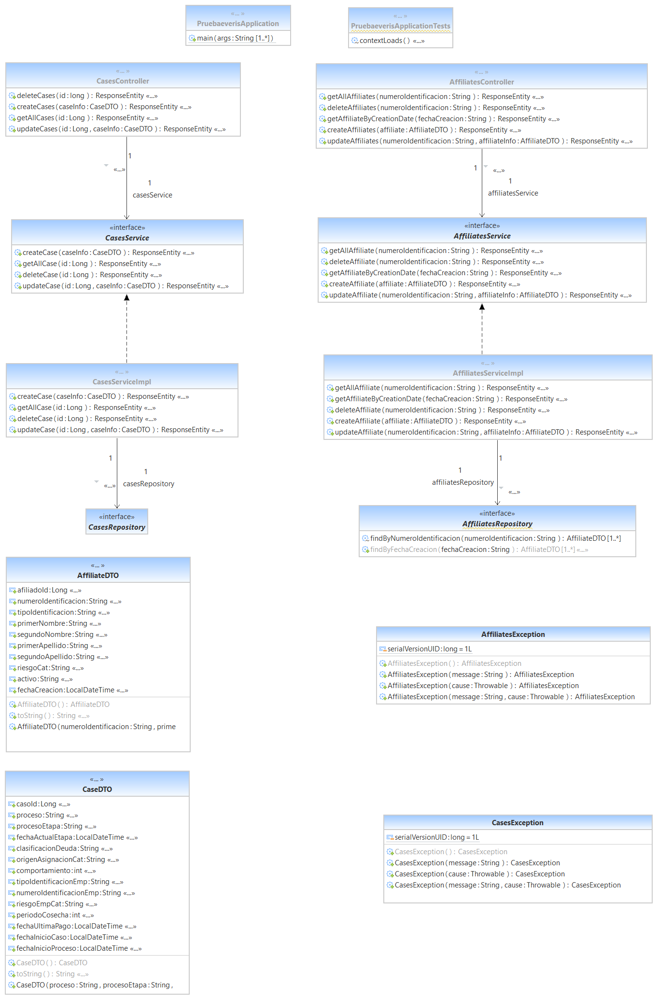

# Prueba técnica para desarrollador backend

## Class Model

## Documentacion Swagger

# App desplegada en Heroku

## Pre-Requisitos

* Java jdk 8
* Maven (Apache Maven)
* Git
  

## Herramientas

* [Maven](https://maven.apache.org/) - Dependency Management
* [JAVA JDK 8](http://www.oracle.com/technetwork/java/javase/overview/index.html) - Building
* [JUnit 3.8.1](https://mvnrepository.com/artifact/junit/junit/3.8.1) - Test
* [Spring Framework 2.3.1](https://spring.io/projects/spring-framework) - Framework
* [Swagger 3.0](https://swagger.io/) - Documentation API's

## ¿Qué deseamos evaluarte?

- Creatividad e innovación para resolver el reto.
- Conocimiento en Springboot.
- Conocimiento en Pruebas unitarias.

## ¿Qué se desea?
Implementar una aplicación web orientada a microservicios REST que contenga lo
siguiente.

- CRUD de afiliados.
- CRUD de casos.
- Cobertura de pruebas unitarias al 80%
- Persistencia en base de datos.
- Estrategia de branching.

## Plus del ejercicio
- Api que permita búsqueda por filtros.
- Un filtro que mezcle fechas con la tabla afiliados.
- Manejo de excepciones y errores.
- Documentación de Api´s con Swagger.

## Entregables
- El proyecto debe ser entregado en un repositorio GitHub.
- Redactar un documento explicando la solución propuesta.
